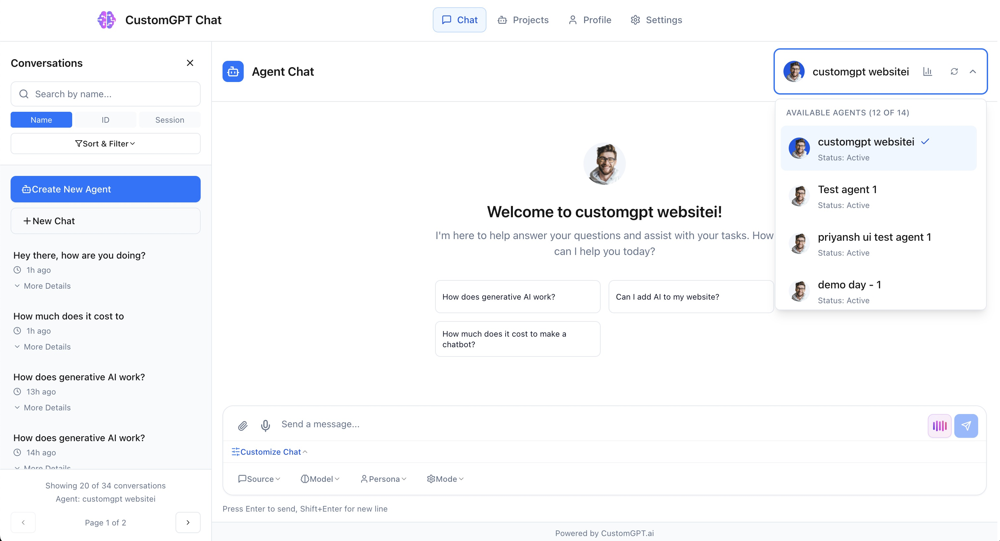
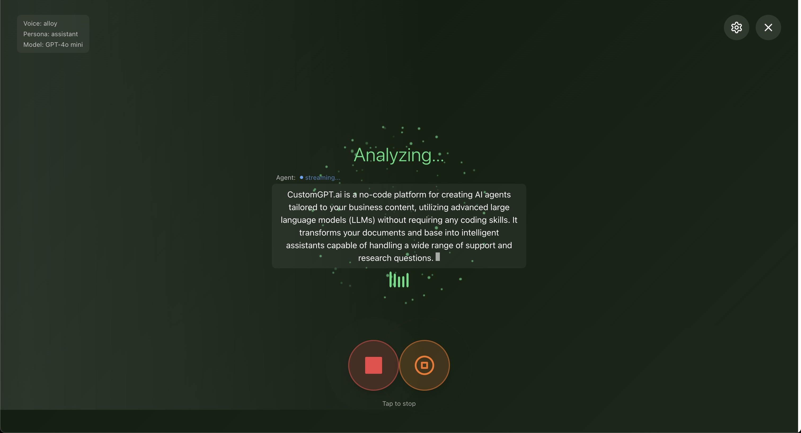
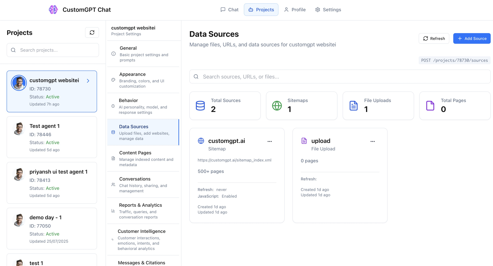
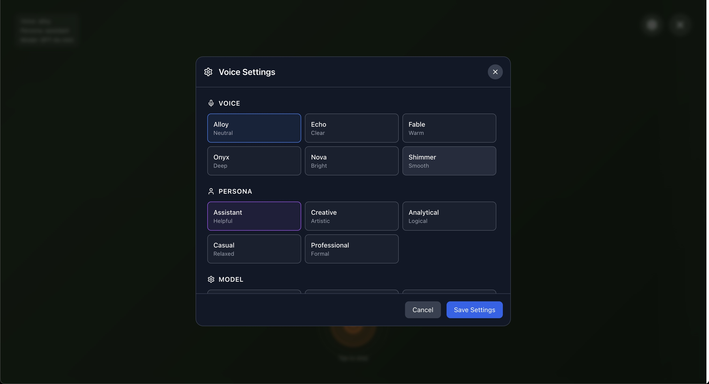

<div align="center">
  
  <h1>CustomGPT.ai API Starter Kit</h1>
  <p><strong>A modern, secure chat interface for CustomGPT.ai's RAG API with multiple deployment options including embedded widgets, floating buttons, and standalone applications.</strong></p>
  
  <br />
  
  <a href="https://starterkit.customgpt.ai/" target="_blank">
    
  </a>
  <a href="https://starterkit.customgpt.ai/" target="_blank">
    
  </a>
  
  <br /><br />
  
  <a href="https://starterkit.customgpt.ai/" target="_blank">
    
  </a>
  
  <p><em>↑ Click the image to try the live demo at <a href="https://starterkit.customgpt.ai/">starterkit.customgpt.ai</a></em></p>
</div>

## 🌐 Live Demo Available

<div align="center">
  <table>
    <tr>
      <td align="center" style="padding: 20px;">
        <h3>🎮 Try the Live Demo</h3>
        <p>Experience the full-featured CustomGPT.ai interface instantly</p>
        <a href="https://starterkit.customgpt.ai/" target="_blank">
          
        </a>
        <br /><br />
        <strong>No installation required!</strong>
        <ul align="left">
          <li>✅ Test with your own CustomGPT.ai agents</li>
          <li>✅ Explore voice chat & file uploads</li>
          <li>✅ See citations in action</li>
          <li>✅ Perfect for demos & presentations</li>
        </ul>
        <p><em>Just enter your API key and agent ID to start</em></p>
      </td>
    </tr>
  </table>
</div>

---

## Screenshots

<div align="center">
  <table>
    <tr>
      <td align="center">
        
        <br />
        <em>Main Chat Interface</em>
      </td>
      <td align="center">
        
        <br />
        <em>Voice Chat Feature</em>
      </td>
    </tr>
    <tr>
      <td align="center">
        
        <br />
        <em>Agent Settings</em>
      </td>
      <td align="center">
        
        <br />
        <em>Voice Settings</em>
      </td>
    </tr>
  </table>
  
  <p>📸 <a href="public/img">View full-size images</a></p>
</div>

## Demo Video

<div align="center">
  <a href="https://www.youtube.com/watch?v=uW7eTGPXYLs">
    
  </a>
  
  <p>🎥 <a href="https://www.youtube.com/watch?v=uW7eTGPXYLs">Watch the full demo video on YouTube</a></p>
</div>

## Table of Contents

- [🚀 Try It Now - Live Playground](#-try-it-now---live-playground)
- [🏠 Run Locally](#-run-locally)
- [🧩 Widget Integration](#-widget-integration)
- [Features](#features)
- [Security](#security)
- [Configuration Options](#configuration-options)
- [Building and Deployment](#building-and-deployment)
- [Examples](#examples)
- [Related Projects](#related-projects)
- [Troubleshooting](#troubleshooting)

## Features

- 🚀 **Multiple Deployment Modes**: Iframe embed, direct widget, floating button, or standalone
- 🔒 **Secure API Proxy**: Server-side API key management
- 💬 **Conversation Management**: Multi-conversation support with persistence
- 🎨 **Customizable UI**: Themes, colors, positioning, and branding options
- 🔄 **Real-time Streaming**: Live message streaming with typing indicators
- 📎 **Rich Media Support**: File uploads, citations, and markdown rendering
- 📱 **Responsive Design**: Works on desktop, tablet, and mobile
- ⚡ **Optimized Performance**: Lazy loading and efficient bundling
- 🏢 **Multi-Agent Support**: Switch between different CustomGPT.ai agents
- 🎭 **Demo Mode**: Try the app without server setup using your own API keys
- 🎤 **Voice Features**: Speech-to-text and voice chat capabilities (requires OpenAI API key)
- 📱 **PWA Ready**: Progressive Web App functionality built-in but disabled by default (see PWA section below)

## Security

This project implements several security best practices:

- **Server-Side API Keys**: API keys are stored only in server environment variables
- **Proxy API Routes**: All API calls go through Next.js API routes that add authentication
- **No Client Exposure**: API keys are never sent to or stored in the browser
- **Environment Variables**: Sensitive configuration is kept in `.env.local`

## 🏠 Run Locally

Want to customize or develop? Run the project locally:

### Prerequisites

- Node.js 18.x or higher
- npm or pnpm
- CustomGPT.ai API key from [CustomGPT.ai Dashboard](https://app.customgpt.ai)

### Setup Steps

1. **Clone the repository:**

```bash
git clone https://github.com/Poll-The-People/customgpt-starter-kit.git
cd customgpt-starter-kit
```

2. **Install dependencies:**

```bash
npm install
# or
pnpm install
```

3. **Create environment file:**

```bash
cp .env.example .env.local
```

4. **Add your API keys to `.env.local`:**

```env
# Required - Server-side only (never exposed to client)
CUSTOMGPT_API_KEY=your-api-key-here

# Optional - For voice features (speech-to-text, voice chat)
OPENAI_API_KEY=your-openai-api-key-here

# Optional - Custom API base URL
CUSTOMGPT_API_BASE_URL=https://app.customgpt.ai/api/v1
```

5. **Start development server:**

```bash
npm run dev
```

The app will be available at `http://localhost:3000`

### Demo Mode

If you don't want to add API keys to environment files, you can use **Demo Mode**:

1. Start the app without API keys in `.env.local`
2. On first visit, select "Demo Mode"
3. Enter your API keys in the UI
4. Keys are stored securely in browser localStorage

**Demo Mode Features:**
- ✅ Full chat functionality with your CustomGPT.ai agents
- ✅ Multi-conversation support
- ✅ File uploads and citations
- ✅ Voice chat (with OpenAI key)
- ⚠️ API keys stored in browser (not recommended for production)

## 🧩 Widget Integration

Add CustomGPT.ai chat to **any website** with these options:

### Option 1: 🌟 CDN (Fastest - 30 seconds!)

**Zero setup required** - just copy and paste:

```html
<!-- Embedded Chat Widget -->
<div id="my-chat" style="width: 400px; height: 600px;"></div>
<script src="https://cdn.jsdelivr.net/gh/Poll-The-People/customgpt-starter-kit@main/dist/widget/customgpt-widget.js"></script>
<script>
  CustomGPTWidget.init({
    agentId: YOUR_AGENT_ID,  // Get from CustomGPT.ai dashboard
    containerId: 'my-chat'
  });
</script>
```

**Want a floating button?** Just change to:

```javascript
CustomGPTWidget.init({
  agentId: YOUR_AGENT_ID,
  mode: 'floating',
  position: 'bottom-right'
});
```

**✅ CDN Benefits:**
- **No build process** - Use immediately  
- **Always latest version** - Auto-updated
- **No hosting required** - Perfect for testing
- **Works everywhere** - Any website, any framework

### Option 2: 🏢 Self-Hosted (For Custom Modifications)

When you need to modify the widget source:

```bash
# Build the widget locally
npm run build:widget

# Host the dist/widget/ files on your server
# Then use your own URL:
```

```html
<script src="https://your-domain.com/dist/widget/customgpt-widget.js"></script>
<script>
  CustomGPTWidget.init({
    agentId: 123,
    containerId: 'chat-widget'
  });
</script>
```

### Option 3: 🔒 Iframe Embed (Maximum Security)

For enterprise security requirements:

```html
<script src="https://your-domain.com/iframe-embed.js"></script>
<script>
  const widget = CustomGPTEmbed.init({
    agentId: 123,
    mode: 'floating',
    iframeSrc: 'https://your-domain.com/widget/',
    position: 'bottom-right'
  });
</script>
```

**Security Benefits:**
- Complete style isolation
- CSP compliance
- Cross-domain support
- No CSS/JS conflicts

### ⚛️ React Integration

**Quick React Hook using GitHub CDN:**

```jsx
import { useEffect, useRef } from 'react';

function ChatWidget({ agentId }) {
  const widgetRef = useRef(null);

  useEffect(() => {
    // Load widget from CDN
    const script = document.createElement('script');
    script.src = 'https://cdn.jsdelivr.net/gh/Poll-The-People/customgpt-starter-kit@main/dist/widget/customgpt-widget.js';
    script.onload = () => {
      const widget = window.CustomGPTWidget.init({
        agentId: agentId,
        containerId: 'my-chat',
        mode: 'embedded'
      });
      widgetRef.current = widget;
    };
    document.body.appendChild(script);

    return () => widgetRef.current?.destroy();
  }, [agentId]);

  return <div id="my-chat" style={{ height: '600px' }} />;
}

// Usage
<ChatWidget agentId={123} />
```

**Or use our pre-built React components:**

```jsx
// See examples/SimplifiedWidget.jsx and examples/SimplifiedFloatingButton.jsx
import SimplifiedWidget from './examples/SimplifiedWidget';

<SimplifiedWidget 
  agentId={123}
  enableConversationManagement={true}
  theme="dark"
/>
```

## Configuration Options

### Core Options

| Option | Type | Required | Description |
|--------|------|----------|-------------|
| `agentId` | number/string | Yes | Your CustomGPT.ai agent ID |
| `mode` | string | No | 'embedded', 'floating', or 'fullscreen' |
| `theme` | string | No | 'light' or 'dark' (default: 'light') |

### Display Options

| Option | Type | Default | Description |
|--------|------|---------|-------------|
| `containerId` | string | - | DOM element ID for embedded mode |
| `position` | string | 'bottom-right' | Position for floating mode |
| `width` | string | '400px' | Widget width |
| `height` | string | '600px' | Widget height |
| `borderRadius` | string | '12px' | Corner radius |
| `zIndex` | number | 9999 | Stack order |

### Feature Options

| Option | Type | Default | Description |
|--------|------|---------|-------------|
| `enableCitations` | boolean | true | Show citation sources |
| `enableFeedback` | boolean | true | Show thumbs up/down buttons |
| `sessionId` | string | auto | Custom session identifier |
| `isolateConversations` | boolean | false | Isolate conversations per page |

### Iframe-Specific Options

| Option | Type | Required | Description |
|--------|------|----------|-------------|
| `iframeSrc` | string | Yes | URL where iframe app is hosted |

## Progressive Web App (PWA)

This application includes full PWA functionality but it is **disabled by default** to provide a cleaner user experience. The PWA features include:

- **Install prompts**: "Add to Home Screen" functionality
- **Offline support**: Service worker caching for offline usage
- **App-like experience**: Fullscreen mode, custom icons, splash screens
- **Update notifications**: Automatic update detection and prompts

### Enabling PWA Features

To enable the PWA install prompt and functionality:

1. Open `src/app/layout.tsx`
2. Uncomment the PWAManager import:
   ```tsx
   import { PWAManager } from '@/components/pwa/PWAManager';
   ```
3. Uncomment the PWAManager component:
   ```tsx
   <PWAManager />
   ```

The PWA will then show an install prompt to users and provide the full Progressive Web App experience.

### PWA Configuration

The PWA settings are configured in:
- `public/manifest.json` - App metadata, icons, theme colors
- `public/sw.js` - Service worker for offline caching
- `src/components/pwa/PWAManager.tsx` - Install prompt UI and update handling

## Building and Deployment

### Build for Production

```bash
# Build everything
npm run build:all

# Build individual components
npm run build:widget    # Widget bundle only
npm run build:iframe    # Iframe app only
npm run build          # Next.js standalone app
```

### Build Outputs

#### Widget Bundle (`dist/widget/`)
- `customgpt-widget.js` (179KB) - Main widget bundle
- `customgpt-widget.css` (76KB) - Widget styles
- `vendors.js` (1.57MB) - React and dependencies
- `index.html` - Demo/test page

#### Iframe App (`dist/iframe/`)
- `iframe-app.js` (154KB) - Iframe application
- `iframe-app.css` (75KB) - Iframe styles
- `vendors.js` (1.57MB) - Shared dependencies
- `index.html` - Iframe container

#### Standalone App
- `.next/` - Next.js build output

**Key Features:**
- 🔐 **Multiple API Key Options** - Proxy, environment variables, or runtime config
- 🎨 **Theme Support** - Light, dark, and auto themes
- 📱 **Responsive Design** - Works on all device sizes
- 🔊 **Voice Input** - Built-in speech recognition
- 📎 **File Upload** - Document and image support
- 🌐 **Iframe Isolation** - Complete CSS and JS isolation

### Deployment Options

#### 1. Docker (Recommended)

The project includes comprehensive Docker support with flexible deployment options:

```bash
# Quick start - Main application only
docker-compose up app

# Widget only
docker-compose --profile widget up widget

# Iframe only
docker-compose --profile iframe up iframe

# Everything with production proxy
docker-compose --profile all up

# Development environment
docker-compose --profile dev up dev
```

**Setup**:

1. Copy environment file: `cp .env.docker.example .env`
2. Add your API keys:
   - `CUSTOMGPT_API_KEY=your-api-key-here`
   - `OPENAI_API_KEY=your-openai-key-here` (optional, for voice features)
3. Run desired service: `docker-compose up app`

**Available Services**:
- **`app`** (port 3000): Full Next.js application with dashboard
- **`widget`** (port 8080): Widget-only static files for embedding
- **`iframe`** (port 8081): Iframe-only static files for embedding  
- **`nginx`** (ports 80/443): Production reverse proxy with SSL
- **`dev`** (ports 3000/8080/8081): Development environment with hot reload

#### 2. Vercel (For Next.js App)

[](https://vercel.com/new/clone?repository-url=https://github.com/Poll-The-People/customgpt-starter-kit)

1. Click the deploy button
2. Add environment variables:
   - `CUSTOMGPT_API_KEY`: Your API key

#### 3. Static Hosting (For Widget Only)

```bash
# Build widget files
npm run build:widget
npm run build:iframe

# Upload dist/widget/ and dist/iframe/ to your CDN or static host
```

#### 4. Manual Docker Build

```bash
# Build specific deployment target
docker build --target standalone -t customgpt-ui:app .
docker build --target widget -t customgpt-ui:widget .
docker build --target iframe -t customgpt-ui:iframe .

# Run standalone app
docker run -p 3000:3000 -e CUSTOMGPT_API_KEY=your-key customgpt-ui:app

# Run widget server
docker run -p 8080:80 customgpt-ui:widget

# Run iframe server  
docker run -p 8081:80 customgpt-ui:iframe
```

## Examples & Integration Guide

The `examples/` directory contains **complete widget integration examples** for every framework and use case.

**📖 [View Complete Examples Guide →](examples/README.md)**

### 🚀 Quick Integration Options

**Development/Demo Setup**:
```html
<script src="https://cdn.jsdelivr.net/gh/Poll-The-People/customgpt-starter-kit@main/dist/widget/customgpt-widget.js"></script>
<script>
  CustomGPTWidget.init({
    agentId: 'YOUR_AGENT_ID',
    apiKey: 'YOUR_API_KEY',  // ⚠️ Development only
    containerId: 'chat-container'
  });
</script>
```

**React Production Setup**:
```jsx
<SimplifiedWidget
  agentId={process.env.REACT_APP_CUSTOMGPT_AGENT_ID}
  apiBaseUrl="http://localhost:3001/api/customgpt"
/>
```

**Next.js Production Setup**:
```jsx
<SimplifiedWidget
  agentId={process.env.NEXT_PUBLIC_CUSTOMGPT_AGENT_ID}
  apiBaseUrl="/api/customgpt"
/>
```

### 📁 Available Examples

- **`quick-start.html`** - Interactive demo and testing tool
- **React Components** - `SimplifiedWidget.jsx`, `SimplifiedFloatingButton.jsx`
- **Vanilla JavaScript** - `vanilla-js-widget.html`, `widget-direct-api.html`
- **Security-First** - `iframe-embed-example.html`
- **Server Setup** - `universal-proxy-server.js`, `nextjs-api-route.js`
- **Setup Guides** - Environment variables, security best practices

**🔗 [Complete Examples Documentation →](examples/README.md)**

## Related Projects

### 🤖 Social Media & Platform Integrations

**[CustomGPT.ai Integrations](https://github.com/Poll-The-People/customgpt-integrations)**
- Deploy CustomGPT.ai bots on WhatsApp, Discord, Slack, Telegram, and more
- Pre-built bot integrations for popular messaging platforms
- Use your CustomGPT.ai agent's knowledge base across all platforms
- Multiple free hosting options included

### 📚 API Usage & Examples

**[CustomGPT.ai Cookbook](https://github.com/Poll-The-People/customgpt-cookbook)**
- Comprehensive API usage examples and guides
- Python SDK and CLI tools
- Code samples for common integration patterns
- OpenAPI specifications and testing utilities

### 🔍 RAG Resources

**[Awesome RAG](https://github.com/Poll-The-People/awesome-rag)**
- Curated list of Retrieval-Augmented Generation resources
- Tools, papers, benchmarks, and tutorials
- Vector databases, embedding models, and RAG architectures
- Everything you need to understand and implement RAG systems

## Development

### Project Structure

```
customgpt-starter-kit/
├── app/                  # Next.js app directory
│   └── api/             
│       └── proxy/       # Secure API proxy routes
├── src/
│   ├── components/      # React components
│   ├── store/          # State management (Zustand)
│   ├── lib/            # Utilities and API client
│   └── widget/         # Widget-specific code
├── public/             # Static assets
├── dist/              # Build outputs
└── examples/          # Integration examples
```

### Development Commands

```bash
# Start development server
npm run dev

# Run widget dev server
npm run dev:widget

# Type checking
npm run type-check

# Linting
npm run lint

# Run all builds
npm run build:all
```

### Adding New Features

1. Components go in `src/components/`
2. API logic goes in `src/lib/api/`
3. State management in `src/store/`
4. Widget-specific code in `src/widget/`

### API Proxy Setup

The application uses Next.js API routes as a proxy to securely handle API authentication:

#### Proxy Endpoints

All API calls go through `/api/proxy/*` which adds the API key server-side:

- `/api/proxy/agents` - Agent management
- `/api/proxy/conversations` - Conversation handling  
- `/api/proxy/messages` - Message operations
- `/api/proxy/sources` - Source management

#### Environment Variables

```env
# Required - Your CustomGPT.ai API key (server-side only)
CUSTOMGPT_API_KEY=your-api-key-here

# Optional - For voice features (speech-to-text, voice chat)
OPENAI_API_KEY=your-openai-api-key-here

# Optional - Custom API base URL
CUSTOMGPT_API_BASE_URL=https://app.customgpt.ai/api/v1

# Optional - Allowed origins for CORS
ALLOWED_ORIGINS=https://yourdomain.com,https://anotherdomain.com
```

## Troubleshooting

### Widget Not Loading

1. Check browser console for errors
2. Verify agent ID is correct
3. Ensure your domain is allowed (CORS)
4. Check that API proxy is working

### API Errors

1. Verify API key in `.env.local`
2. Check API proxy routes are deployed
3. Look for errors in server logs
4. Ensure API key has correct permissions

### Demo Mode Issues

1. **"API key required" errors**: Ensure you've entered your API keys in demo settings
2. **Voice features not working**: Add OpenAI API key in demo configuration
3. **Keys not persisting**: Check browser's localStorage is not being cleared
4. **Can't exit demo mode**: Clear localStorage or switch to production mode

### Voice Features Issues

1. **Speech-to-text not working**: 
   - Check microphone permissions
   - Ensure OpenAI API key is configured
   - Verify browser supports Web Speech API
2. **Voice chat errors**: 
   - Both CustomGPT.ai and OpenAI keys are required
   - Check browser console for specific errors

### Styling Issues

1. Check for CSS conflicts
2. Use iframe mode for better isolation
3. Increase z-index if needed
4. Check responsive breakpoints

## Support

- Issues: [GitHub Issues](https://github.com/Poll-The-People/customgpt-starter-kit/issues)
- Documentation: [CustomGPT.ai Docs](https://docs.customgpt.ai)
- Email: support@customgpt.ai

## License

MIT License - see LICENSE file for details.